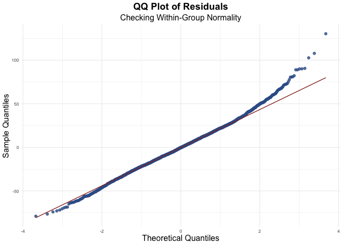
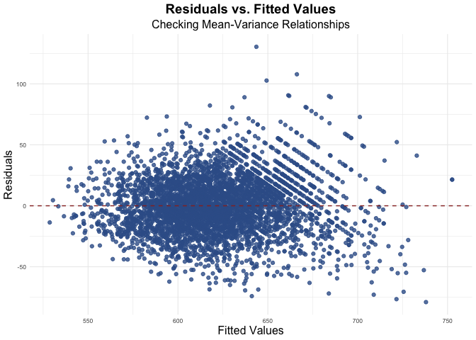
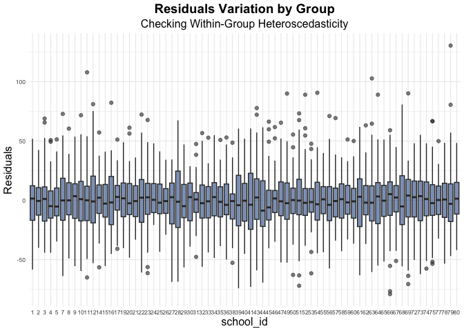

<!-- README.md is generated from README.Rmd. Please edit that file -->

# lme4u <a href="https://github.com/hollyyfc/lme4u"></a>

<!-- badges: start -->

[](https://github.com/hollyyfc/lme4u/actions/workflows/R-CMD-check.yaml)
<!-- badges: end -->

## Overview

lme4u is an interpretation and diagnostic tool for linear mixed-effects
models fitted with
[lme4](https://cran.r-project.org/web/packages/lme4/index.html) package.
It aims to provide:

- **Interpretive functions** that translate `lmer()` output into
  user-friendly explanations.
- **Diagnostic tools** for checking model assumptions and visualizing
  hierarchical structures.
- **Hypothesis testing utilities** to facilitate model comparison and
  statistical inference.
- **Curated data** for the purpose of exploring mixed-effect models.

## Installation

You can install the development version of lme4u from
[GitHub](https://github.com/) with:

``` r
devtools::install_github("hollyyfc/lme4u")

# Alternatively:
# install.packages("pak")
pak::pak("hollyyfc/lme4u")
```

## Example

lme4u is built to assist with lme4 modeling, so make sure both packages
are properly loaded:

``` r
library(lme4u)
library(lme4)
```

### To Interpret

This core interpretation function provides user-friendly explanation of
a fitted lmer model’s fixed and random effects:

``` r
model <- lme4::lmer(math ~ cltype + math_old + (cltype | school_id), data = star)

explain_lmer(model, details = "general")
#> This linear mixed-effects model examines how cltype, math_old affects math, while accounting for group-level variability across school_id.
#> 
#> The model adjusts for fixed effect(s), including cltype, math_old, which estimate the overall relationship with math across the entire dataset. For more detailed interpretations of fixed effects, use `details = "fixed"`.
#> 
#> The model includes the following random effects across grouping variables: cltype | school_id.
#>  *The random intercept(s), school_id, account for variations in the intercept across different groups, allowing each group to have its own baseline value that deviates from the overall average.
#>  *On top of the varying baselines, the model allows the effects of cltype on math to differ across their corresponding groups. This means that not only can each group start from a different baseline, but the strength and direction of the relationships between these variables and math can also vary from one group to another.
#> Check `details = 'random'` for more interpretation.
```

### To Test Hypothesis

Conduct likelihood ratio test (LRT) on a selected fixed or random effect
in a fitted lmer model:

``` r
fix_result <- lrt_lmer(model, target = "math_old", type = "fixed", data = star)
#> Likelihood Ratio Test for 'math_old' (fixed effect)
#> Full Model: math ~ cltype + math_old + (cltype | school_id)
#> Reduced Model: math ~ cltype + (cltype | school_id)
#> Test Statistics:
#> - Log-Likelihood Difference: 3202.807
#> - Degrees of Freedom: 1 (Difference in estimated parameters)
#> - P-Value: < 2.2e-16 (Chi-square test)
#> Since p = < 2.2e-16, under alpha level of 0.05, we reject the null hypothesis. The test suggests that the fixed effect of math_old is statistically significant and contributes to the model.

fix_result
#> $logLik
#> [1] 3202.807
#> 
#> $df
#> [1] 1
#> 
#> $pvalue
#> [1] 0
```

### To Check Assumptions

Gain insights on within-group heterogeneity with core residual plots:

``` r
library(ggplot2)

res_norm(model)
```



``` r
res_fit(model)
```



``` r
res_box(model, group_var = "school_id")
```



### To Explore

Utilize this fresh dataset curated specifically for mixed-effect
modeling:

``` r
tibble::glimpse(star)
#> Rows: 4,192
#> Columns: 13
#> $ school_id <fct> 63, 20, 5, 50, 69, 79, 5, 41, 19, 78, 11, 66, 38, 69, 43, 52…
#> $ system_id <fct> 30, 11, 4, 21, 35, 41, 4, 17, 11, 41, 8, 32, 14, 35, 18, 22,…
#> $ sctype    <fct> rural, suburban, rural, rural, rural, rural, rural, suburban…
#> $ gender    <fct> female, female, female, male, male, male, male, female, fema…
#> $ ethnicity <fct> cauc, afam, cauc, cauc, cauc, cauc, cauc, cauc, afam, cauc, …
#> $ cltype    <fct> small, regular+aide, regular+aide, regular, regular, small, …
#> $ tdegree   <fct> bachelor, bachelor, bachelor, master, bachelor, bachelor, ba…
#> $ tyear     <int> 1, 4, 23, 8, 7, 14, 8, 19, 26, 13, 14, 24, 3, 12, 6, 15, 9, …
#> $ lunch     <fct> free, non-free, non-free, non-free, non-free, free, free, no…
#> $ read_old  <int> 568, 588, 573, 596, 614, 608, 608, 586, 520, 596, 569, 608, …
#> $ read      <int> 587, 644, 599, 626, 641, 665, 597, 606, 578, 606, 606, 654, …
#> $ math_old  <int> 579, 579, 550, 590, 639, 603, 579, 603, 540, 587, 584, 546, …
#> $ math      <int> 593, 639, 583, 618, 684, 648, 589, 631, 606, 667, 596, 606, …
```

## Contributing

If you’re interested in contributing, reporting issues, or suggesting
features, feel free to open an issue in the [GitHub
repository](https://github.com/hollyyfc/lme4u/issues).
